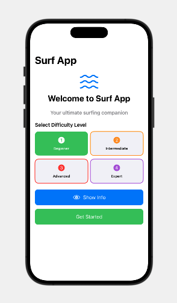
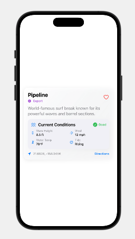

# Surf App - Swift & Apple Design Best Practices

A comprehensive iOS app demonstrating modern Swift development practices and Apple's Human Interface Guidelines.

## 📱 Screenshots

  
  

*Welcome screen with difficulty selector and surf spots list with filtering*

## 🏄‍♂️ Features

- **Real-time Surf Conditions**: Check wave height, wind, tide, and water temperature
- **Spot Discovery**: Find surf spots near you with difficulty ratings
- **Modern UI**: Built with SwiftUI following Apple's design principles
- **Accessibility**: Full VoiceOver support and accessibility features
- **Dark Mode**: Automatic light/dark mode support

## 🚀 Getting Started

1. **Clone the repository**
2. **Open in Xcode 15+**
3. **Build and run on iOS 17+**

## 📋 Requirements

- **iOS 17.0+**
- **Xcode 15.0+**
- **Swift 5.9+**